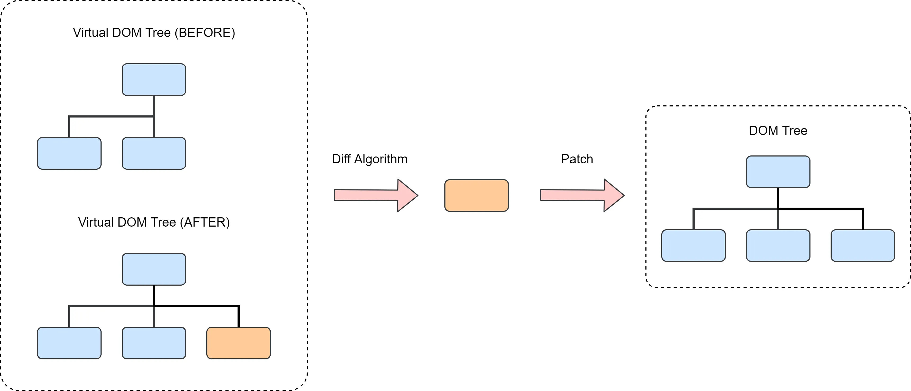

# Virtual DOM

Virtual DOM (VDOM) 就是用一個 JavaScript 物件來描述 UI 結構的方式。虛擬 DOM 不直接操作真實 DOM，而是先對 UI 的更新在虛擬 DOM 上進行，然後通過比較新舊虛擬 DOM 的差異來決定如何高效地更新真實 DOM。



## 實作一個簡易的 Virtual DOM

```jsx
const App = () => {
  return (
    <div id='1'>
      <span>Hello, Virtual DOM!</span>
    </div>
  );
};
```

這段程式碼經過 Babel 或是 SWC 轉譯後，會變成：

```js
const App = () => {
  return React.createElement(
    'div',
    { id: '1' },
    React.createElement('span', null, 'Hello, Virtual DOM!')
  );
};
```

那麼接著就來實作這個 `React.createElement`

### React.createElement

它用於創建一個虛擬 DOM 樹，回傳一個包含 type（元素類型）、props（屬性和子元素）的物件。children 可以是文字或其他虛擬 DOM 節點。

```js
const React = {
  createElement(type, props, ...children) {
    return {
      type,
      props: {
        ...props,
        children: children.map((child) => {
          if (typeof child === 'object') {
            // 如果子元素是物件（巢狀元素），直接回傳
            return child;
          }
          // 否則將字串轉換為文字元素
          return this.createTextElement(child);
        }),
      },
    };
  },
  // 用於創建文字節點的虛擬 DOM
  createTextElement(text) {
    return {
      type: 'TEXT_ELEMENT',
      props: {
        nodeValue: text,
        children: [],
      },
    };
  },
};

// 測試我們的 createElement 函式
const vdom = React.createElement('div', { id: 1 }, React.createElement('span', null, 'Hello'));
console.log(vdom);
```

## React Fiber

Fiber 是 React 16 引入的一個新的架構，用於解決和最佳化 React 應對複雜 UI 渲染時的性能問題。

### Fiber 的作用

為了解決在大元件更新時可能導致的卡頓問題，React 團隊設計出了 Fiber 架構，把同步遞迴無法中斷的更新重構為非同步的可中斷更新。

它達成了 4 個具體目標：

1. **可中斷的渲染**: Fiber 允許將大的渲染任務拆分成多個小的工作單元（units of work），使得 React 可以在空閒時間執行這些小任務。當瀏覽器需要處理高優先順序的任務（如使用者輸入或動畫），可以暫停渲染工作，先處理這些任務，然後再恢復未完成的渲染工作。
2. **優先順序調度**: 在 Fiber 架構中，每個更新都有一個優先順序。React 可以根據任務的優先順序來決定哪些任務應該先執行，而低優先順序的任務可以稍後再處理，這樣可以確保使用者體驗的流暢性。
3. **Double Buffering**: Fiber 架構維護了兩個 Fiber 樹：current tree（目前正在渲染的 Fiber 樹）和 work-in-progress tree（正在構建的 Fiber 樹）。React 使用這兩棵樹來保存更新前後的狀態，從而更高效地進行比較和更新。
4. **任務（時間）切片**: 在瀏覽器的空閒時間內（利用 `requestIdleCallback` 思想），React 可以將渲染任務拆分成多個小片段，逐步完成 Fiber 樹的建構，避免一次性完成所有渲染任務導致的阻塞。

### Double Buffering

react 內部會維護兩棵 Fiber 樹，目前畫面上顯示內容對應的 Fiber 樹稱為 fiber tree，正在更新的內容會被構建在 work-in-progress fiber tree 上。

react 應用的 root 會有一個 current 指向目前顯示的 fiber tree，還有一個 alternate 指向正在更新的 work-in-progress fiber tree。當更新完成後，react 會將 current 指向剛剛更新完成的 work-in-progress fiber tree，此時 work-in-progress fiber tree 就變成了新的 fiber tree 完成更新。

## Diffing 演算法

當 react 需要更新 UI 時，它會先創建一個新的虛擬 DOM 樹，然後將這個新的虛擬 DOM 樹與舊的虛擬 DOM 樹進行比較，找出差異，最後只更新那些有變化的部分到真實 DOM 上。這個過程稱為 diffing。

比如有 A B C D 四個節點，那麼 react 會先把這些節點變成一個 linked list：

```txt
root
 |
 A -> B -> C -> D
```

然後我們更新成了 A C B E：

1. {`A`, `B`, `C`, D} 它會去從 map（如果有 key）找出能夠重用的節點，也就是 `A C B` 進行重用。
2. 如果 {A B C D} 這個結構沒有出現過 `E`，說明是新增了新的 fiber 節點。
3. 如果 {A B C `D`} 舊節點沒有出現在新節點中 {A C B E}，說明 `D` 節點被刪除了。 


## 程式碼實作

```js
const React = {
  createElement(type, props, ...children) {
    return {
      type,
      props: {
        ...props,
        children: children.map((child) => {
          if (typeof child === 'object') {
            return child;
          }
          return this.createTextElement(child);
        }),
      },
    };
  },
  createTextElement(text) {
    return {
      type: 'TEXT_ELEMENT',
      props: {
        nodeValue: text,
        children: [],
      },
    };
  },
};

let nextUnitOfWork = null;
let wipRoot = null; // 正在工作的 fiber 樹
let currentRoot = null; // 舊的 fiber 樹
let deletions = null; // 存放要刪除的 fiber 節點

function render(element, container) {
  // 初始化 fiber 結構
  wipRoot = {
    dom: container,
    props: {
      children: [element],
    },
    alternate: currentRoot,
  };
  deletions = [];
  nextUnitOfWork = wipRoot;
}

function createDom(fiber) {
  const dom =
    fiber.type === 'TEXT_ELEMENT'
      ? document.createTextNode('')
      : document.createElement(fiber.type);

  updateDom(dom, {}, fiber.props);
  return dom;
}

function updateDom(dom, prevProps, nextProps) {
  // 清除舊的屬性
  Object.keys(prevProps)
    .filter((key) => key !== 'children')
    .forEach((name) => {
      dom[name] = '';
    });

  // 設置新的屬性
  Object.keys(nextProps)
    .filter((key) => key !== 'children')
    .forEach((name) => {
      dom[name] = nextProps[name];
    });
}

function workLoop(deadline) {
  let shouldYield = false;

  while (nextUnitOfWork && !shouldYield) {
    nextUnitOfWork = performUnitOfWork(nextUnitOfWork);
    shouldYield = deadline.timeRemaining() < 1;
  }

  // nextUnitOfWork 為空，表示所有工作完成並且可以提交更改
  if (!nextUnitOfWork && wipRoot) {
    commitRoot();
  }
  requestIdleCallback(workLoop);
}

requestIdleCallback(workLoop);

function performUnitOfWork(fiber) {
  if (!fiber.dom) {
    fiber.dom = createDom(fiber);
  }

  const elements = fiber.props.children;
  reconcileChildren(fiber, elements);

  if (fiber.child) {
    return fiber.child;
  }

  let nextFiber = fiber;
  while (nextFiber) {
    if (nextFiber.sibling) {
      return nextFiber.sibling;
    }
    nextFiber = nextFiber.parent;
  }

  return null;
}

function reconcileChildren(wipFiber, elements) {
  // generate new fiber
  // diffing algorithm
  let index = 0;
  let oldFiber = wipFiber.alternate && wipFiber.alternate.child;
  let prevSibling = null;

  while (index < elements.length || oldFiber != null) {
    const element = elements[index];

    let newFiber = null;
    const sameType = oldFiber && element && element.type === oldFiber.type;

    // update
    if (sameType) {
      console.log('更新節點:', element);
      newFiber = {
        type: oldFiber.type,
        props: element.props,
        parent: wipFiber,
        dom: oldFiber.dom,
        alternate: oldFiber,
        effectTag: 'UPDATE',
      };
    }

    // add
    if (element && !sameType) {
      console.log('新增節點:', element);
      newFiber = {
        type: element.type,
        props: element.props,
        dom: null,
        parent: wipFiber,
        alternate: null,
        effectTag: 'PLACEMENT',
      };
    }

    // delete
    if (oldFiber && !sameType) {
      console.log('刪除節點:', oldFiber);
      oldFiber.effectTag = 'DELETION';
      deletions.push(oldFiber);
    }

    if (oldFiber) {
      oldFiber = oldFiber.sibling;
    }

    if (index === 0) {
      wipFiber.child = newFiber;
    } else {
      prevSibling.sibling = newFiber;
    }

    prevSibling = newFiber;
    index++;
  }
}

function commitRoot() {
  deletions.forEach(commitWork);
  commitWork(wipRoot.child);
  currentRoot = wipRoot; // 保存舊的 fiber 樹
  wipRoot = null; // 重置正在工作的 fiber 樹
}

function commitWork(fiber) {
  if (!fiber) return;

  const domParentFiber = fiber.parent;
  if (fiber.effectTag === 'PLACEMENT') {
    domParentFiber.dom.appendChild(fiber.dom);
  } else if (fiber.effectTag === 'UPDATE') {
    updateDom(fiber.dom, fiber.alternate.props, fiber.props);
  } else if (fiber.effectTag === 'DELETION') {
    domParentFiber.dom.removeChild(fiber.dom);
  }

  commitWork(fiber.child);
  commitWork(fiber.sibling);
}

const vdom = React.createElement('div', { id: 1 }, React.createElement('span', null, 'Hello'));
render(vdom, document.getElementById('root'));

setTimeout(() => {
  const vdom2 = React.createElement('div', { id: 1 }, React.createElement('p', null, 'World'));
  render(vdom2, document.getElementById('root'));
}, 2000);
```
